# Fontory - 손글씨 폰트 자동 생성 서비스

## 프로젝트 개요

Fontory는 사용자의 손글씨를 입력 받아 개인화된 **TrueType 폰트(.ttf)** 파일을 자동 생성해주는 웹 기반 서비스입니다. 사용자는 지정된 **48자** 분량의 손글씨 샘플을 제출하면, Naver Clova Ai Reaserch의 [DM-Font 모델](https://github.com/clovaai/fewshot-font-generation)을 통해 해당 손글씨 스타일의 글꼴 파일을 얻을 수 있습니다.

## 구조

## 주요 기능 요약

* **손글씨 기반 폰트 생성**: 단 몇 글자의 손글씨 샘플로 전체 글꼴을 자동 생성
* **개인화된 폰트 다운로드**: TTF 및 웹폰트(WOFF) 형식으로 제공
* **비동기 처리**: AWS S3, SQS 기반의 큐잉 시스템으로 안정적인 작업 처리
* **모니터링 및 로깅**: Grafana/Prometheus 메트릭, Loki 로그 집계

## 시스템 구성 요소

### 1. Frontend (Fontory\_React)

* **기술 스택**: React, Vite
* **설명**: SPA 형태의 웹 앱으로, 손글씨 업로드 UI, 진행상황 표시, 결과 다운로드 화면 제공

### 2. Backend (Fontory\_SpringBoot)

* **기술 스택**: Spring Boot, Spring Security (OAuth2 + JWT), Spring Data JPA, MariaDB, Redis, AWS SDK (S3, SQS)
* **설명**:

  * 사용자 인증 및 관리
  * 손글씨 이미지 업로드 → S3 저장 → SQS 메시지 발행
  * 파이프라인 처리 결과를 S3에서 조회하여 다운로드 API 제공

### 3. Pipeline (Fontory\_Pipeline)

* **기술 스택**: Python, FastAPI, PyTorch, OpenCV, Pillow, svgpathtools, fontTools(FontForge), Docker
* **설명**:

  1. 이미지 분할(글리프 크롭)
  2. 딥러닝 추론(DM-FONT 모델)
  3. 벡터화(SVG 변환)
  4. 폰트 파일 생성(TTF, WOFF)
  5. 결과 파일 S3 업로드

  * AWS SQS 메시지 기반 비동기 워커로 동작
  * Docker 컨테이너 격리 실행

## 기술 스택 요약

| 구성 요소    | 기술 스택                                                     |
| :------- | :-------------------------------------------------------- |
| Frontend | React, Vite, CSS/Sass                                     |
| Backend  | Spring Boot, OAuth2, JWT, JPA, MariaDB, Redis, AWS S3/SQS   |
| Pipeline | FastAPI, PyTorch, OpenCV, svgpathtools, fontTools, Docker |
| Infra    | AWS (EC2, S3, SQS, Lambda, CloudFront), Grafana, Prometheus, Loki       |

## 결과

https://github.com/user-attachments/assets/59190e53-707c-47ae-8bdf-b4f3869062e7

---

## License

This project is distributed under the MIT License. See the [LICENSE](./LICENSE) file for details.

### Third-Party Licenses

* **DM-Font** (Naver Clova AI Research) is licensed under the MIT License.
  The above copyright notice and permission notice from DM-Font's repository must be included in all copies or substantial portions of the software.

© 2025 Fontory Team. All rights reserved.
